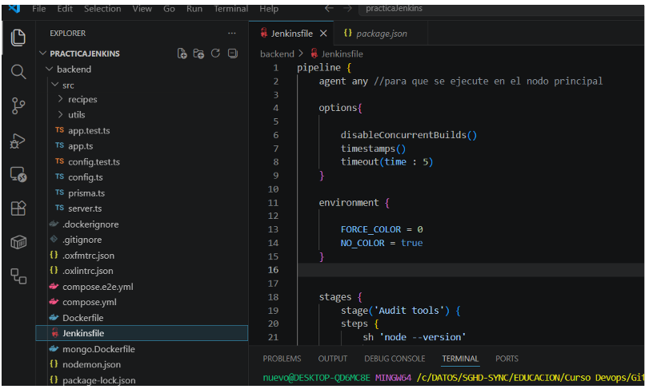
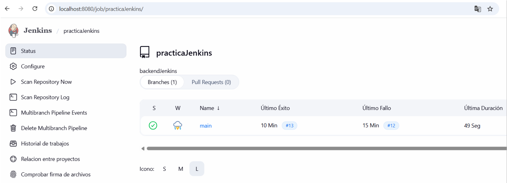
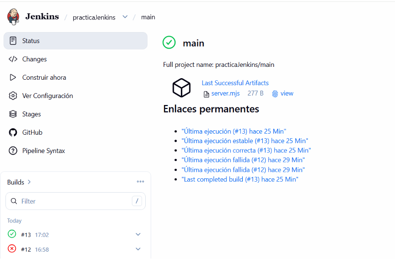
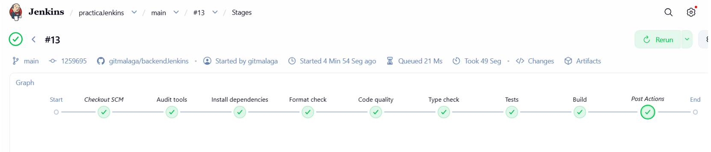
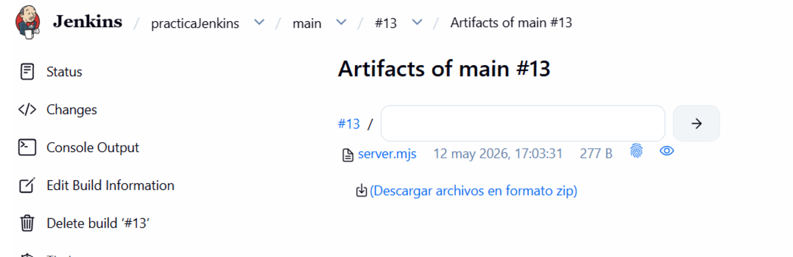

Una vez he creado el repositorio para el proyecto de backend y lo he vinculado con Jenkins, subo al repositorio el fichero Jenkinsfile.

En él se han configurado las opciones pedidas, se han creado las variables pedidas, se han configurado las etapas pedidas y se han configurado las acciones según haya sido el resultado de la ejecución   de la pipeline.

Tras hacerle varias correccions al fichero Jenkinsfile, realizo el commit definitivo y lo subo al repositorio.

Voy a Jenkins y pincho sobre la rama main, para podr hacer el build

Doy a “Construir ahora” para hacer el build

Se genera con éxito y aquí se puden ver todos los stages:

Pulsando sobre “Artefacts” podré ver el fichero generado.

